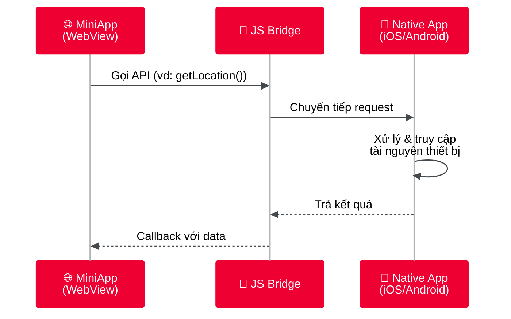

# Nền tảng Superapp Tammi

Nền tảng Superapp Tammi được phát triển bởi Viettel Telecom, tập trung vào tính linh hoạt, khả năng mở rộng và trải nghiệm người dùng liền mạch, cho phép tích hợp đa dạng miniapp trong một hệ sinh thái thống nhất.

Một Miniapp Tammi hoạt động như sau, với phần chính của Tammi bao gồm:

- **Môi trường runtime**: Cung cấp không gian thực thi cho các miniapp
- **Bridge API (jsAPI)**: Giao thức giao tiếp giữa miniapp và các tính năng native của thiết bị

_Hình 1: Luồng giao tiếp giữa MiniApp và Native App thông qua JS Bridge_

Nền tảng cung cấp nhiều thư viện và API để lựa chọn, tùy thuộc vào nhu cầu của ứng dụng. Bạn có thể xây dựng một miniapp đơn giản chỉ với logic nghiệp vụ cơ bản, hoặc tận dụng Bridge API để truy cập các tính năng native như camera, GPS - mang lại trải nghiệm tương tự native app.

## Bắt đầu phát triển

Sẵn sàng xây dựng miniapp? Chọn phương thức phù hợp với bạn:

| Phương thức                                                  | Mô tả                                        |
| ------------------------------------------------------------ | -------------------------------------------- |
| [**A. Xây mới**](/getting_started/A_xay_moi/index)           | Phát triển miniapp từ đầu - linh hoạt nhất   |
| [**B. Chuyển đổi SPA**](/getting_started/B_chuyen_doi/index) | Chuyển đổi ứng dụng React/Vue/Angular có sẵn |
| [**C. Tích hợp Webview**](/getting_started/C_webview/index)  | Nhúng website có sẵn vào miniapp             |

[Xem chi tiết tại Getting Started](/getting_started/index)
