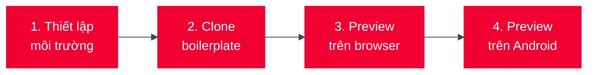

# A. Xây mới Miniapp

Hướng dẫn này giúp bạn xây dựng miniapp Tammi từ đầu, chạy trên thiết bị Android và trải nghiệm các tính năng native thông qua Bridge API.

:::info Phạm vi hướng dẫn
Hướng dẫn này tập trung vào việc **phát triển và preview miniapp trên local**. Quy trình deploy lên Tammi Superapp yêu cầu tài khoản và sẽ được đề cập trong phần riêng.
:::

## Tổng quan quy trình

## Bạn sẽ cần

| Yêu cầu | Mô tả |
|---------|-------|
| **Node.js** | Phiên bản LTS (kiểm tra: `node --version`) |
| **npm** | Đi kèm Node.js (kiểm tra: `npm --version`) |
| **VSCode Extension** | Miniapp Extension của Viettel |
| **Android** | Thiết bị thật hoặc emulator |

## Bắt đầu

Tiếp tục với [Thiết lập môi trường](./thiet_lap_moi_truong) để cài đặt các công cụ cần thiết.
