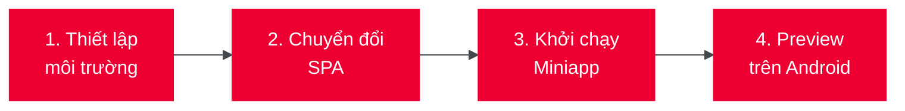

# B. Chuyển đổi SPA

Hướng dẫn này giúp bạn chuyển đổi một **Single-Page Application (SPA)** có sẵn thành miniapp chạy trên Tammi Superapp.

:::info Phạm vi hướng dẫn
Hướng dẫn này tập trung vào việc **chuyển đổi và preview miniapp trên local**. Quy trình deploy lên Tammi Superapp yêu cầu tài khoản và sẽ được đề cập trong phần riêng.
:::

## Tổng quan quy trình

## Yêu cầu

| Yêu cầu              | Mô tả                                              |
| -------------------- | -------------------------------------------------- |
| **Source code SPA**  | Project SPA có sẵn (React, Vue, hoặc Web H5 thuần) |
| **Node.js**          | Phiên bản LTS (kiểm tra: `node --version`)         |
| **npm**              | Đi kèm Node.js (kiểm tra: `npm --version`)         |
| **VSCode Extension** | Miniapp Extension của Viettel                      |
| **Android**          | Thiết bị thật hoặc emulator                        |

## Kiểm tra tính tương thích

Trước khi bắt đầu, hãy đảm bảo SPA của bạn đáp ứng các yêu cầu sau:

| Yêu cầu                 | Mô tả                                                  |
| ----------------------- | ------------------------------------------------------ |
| **Hash-based routing**  | Miniapp yêu cầu routing dạng `/#/path` thay vì `/path` |
| **npm package manager** | Miniapp chỉ hỗ trợ npm, không hỗ trợ yarn/pnpm/bun     |
| **Static SPA**          | Không có server-side rendering (SSR)                   |

:::warning Framework cần lưu ý

- **React / Vue**: Thường tương thích tốt, chỉ cần chuyển sang hash routing
- **Next.js / Nuxt**: Phải tắt SSR và sử dụng static export (`output: 'export'` hoặc `ssr: false`)
- **Angular**: Chưa được kiểm thử đầy đủ, cần liên hệ Viettel để đánh giá
  :::

## Bắt đầu

Tiếp tục với [Thiết lập môi trường](./thiet_lap_moi_truong) để cài đặt các công cụ cần thiết.
