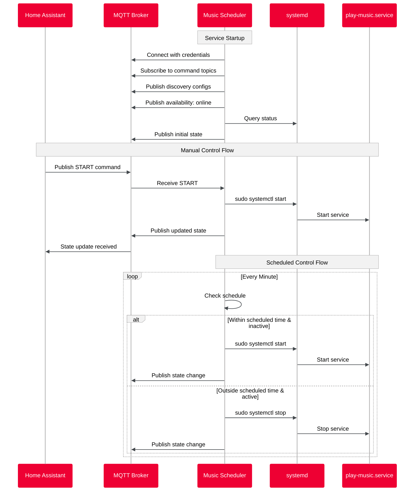

```mermaid
%%{init: {
  'theme': 'base',
  'themeVariables': {
    'primaryColor': '#EE0033',
    'primaryTextColor': '#FFFFFF',
    'primaryBorderColor': '#EE0033',
    'lineColor': '#44494D',
    'secondaryColor': '#F2F2F2',
    'tertiaryColor': '#B5B4B4',
    'background': '#FFFFFF',
    'mainBkg': '#FFFFFF',
    'secondaryBkg': '#EE0033',
    'tertiaryBkg': '#F2F2F2',
    'activationBorderColor': '#44494D',
    'activationBkgColor': '#F2F2F2',
    'sequenceNumberColor': '#000000',
    'sectionBkgColor': '#F2F2F2',
    'altSectionBkgColor': '#F2F2F2',
    'gridColor': '#B5B4B4',
    'textColor': '#000000',
    'actorTextColor': '#FFFFFF',
    'actorBkg': '#EE0033',
    'actorBorder': '#EE0033',
    'actorLineColor': '#B5B4B4',
    'signalColor': '#44494D',
    'signalTextColor': '#000000',
    'labelBoxBkgColor': '#F2F2F2',
    'labelBoxBorderColor': '#B5B4B4',
    'labelTextColor': '#000000',
    'loopTextColor': '#000000',
    'noteTextColor': '#000000',
    'noteBkgColor': '#F2F2F2',
    'noteBorderColor': '#B5B4B4'
  }
}}%%
sequenceDiagram
    participant HA as Home Assistant
    participant MQTT as MQTT Broker
    participant Scheduler as Music Scheduler
    participant Systemd as systemd
    participant Music as play-music.service

    Note over Scheduler: Service Startup
    Scheduler->>MQTT: Connect with credentials
    Scheduler->>MQTT: Subscribe to command topics
    Scheduler->>MQTT: Publish discovery configs
    Scheduler->>MQTT: Publish availability: online
    Scheduler->>Systemd: Query status
    Scheduler->>MQTT: Publish initial state

    Note over HA,Music: Manual Control Flow
    HA->>MQTT: Publish START command
    MQTT->>Scheduler: Receive START
    Scheduler->>Systemd: sudo systemctl start
    Systemd->>Music: Start service
    Scheduler->>MQTT: Publish updated state
    MQTT->>HA: State update received

    Note over Scheduler,Music: Scheduled Control Flow
    loop Every Minute
        Scheduler->>Scheduler: Check schedule
        alt Within scheduled time & inactive
            Scheduler->>Systemd: sudo systemctl start
            Systemd->>Music: Start service
            Scheduler->>MQTT: Publish state change
        else Outside scheduled time & active
            Scheduler->>Systemd: sudo systemctl stop
            Systemd->>Music: Stop service
            Scheduler->>MQTT: Publish state change
        end
    end

```
