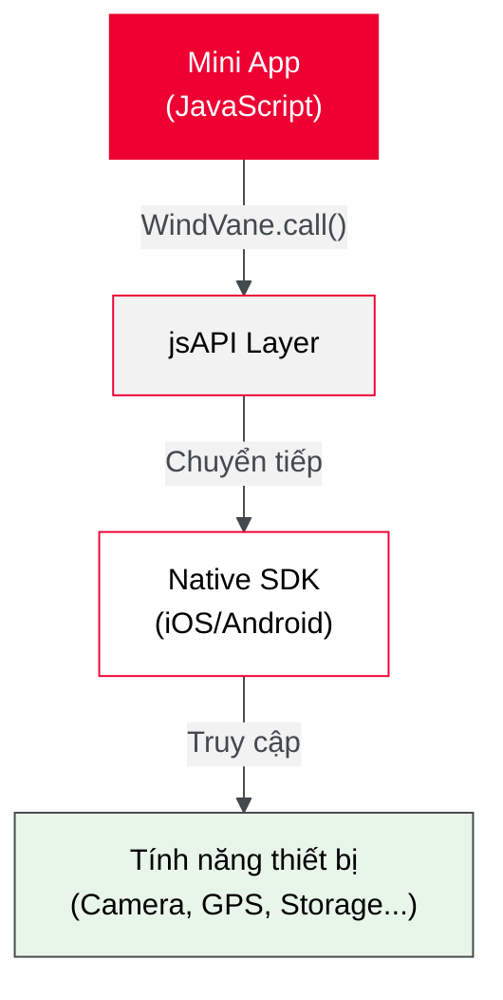

# jsAPI - Bridge APIs

jsAPI (còn gọi là Bridge API) là lớp trung gian cho phép miniapp truy cập các tính năng native của thiết bị thông qua Tammi Superapp.

## jsAPI hoạt động như thế nào?



## Cấu trúc lời gọi cơ bản

Tất cả jsAPI đều được gọi thông qua object `window.WindVane`:

```javascript
window.WindVane.call(
  "ModuleName", // Tên module (vd: 'WVCamera', 'WVLocation')
  "methodName", // Tên method (vd: 'takePhoto', 'getLocation')
  {
    /* params */
  }, // Tham số đầu vào
  function (result) {
    // Success callback
    console.log("Thành công:", result);
  },
  function (error) {
    // Fail callback
    console.error("Thất bại:", error);
  },
);
```

## Danh mục jsAPI

jsAPI được tổ chức theo các nhóm chức năng:

| Danh mục                                           | Mô tả                      | APIs tiêu biểu                           |
| -------------------------------------------------- | -------------------------- | ---------------------------------------- |
| [**App & Base**](./A_app_base/index)               | Chức năng cơ bản của app   | canIUse, copyToClipboard, openBrowser    |
| [**Auth & User**](./B_auth_user/index)             | Xác thực và thông tin user | getAuthCode, contacts                    |
| [**Device & Hardware**](./C_device_hardware/index) | Truy cập phần cứng         | Camera, GPS, Bluetooth, Sensor           |
| [**File & Storage**](./D_file_storage/index)       | Quản lý file và lưu trữ    | chooseFiles, read/write, upload/download |
| [**UI & Interaction**](./E_ui_interaction/index)   | Giao diện và tương tác     | Toast, Dialog, NavigationBar             |
| [**Media & Location**](./F_media_location/index)   | Media và vị trí            | Image, Video, Location                   |
| [**Viettel Specific**](./G_viettel_specific/index) | API đặc thù Viettel        | Device Service, Dev Tools                |

## Điều kiện tiên quyết

:::warning Quyền hạn
Hầu hết jsAPI yêu cầu **phê duyệt quyền** từ Tammi Superapp. Xem [Quyền hạn và phê duyệt](./jsapi/truoc_khi_bat_dau) trước khi sử dụng.
:::

:::info Sample Code
Repository đầy đủ mẫu code: [miniapp-sample-code](https://github.com/mahou-anisphia/miniapp-sample-code)
:::

## Tiếp theo

1. **Mới bắt đầu?** → Đọc [Trước khi bắt đầu](./jsapi/truoc_khi_bat_dau) để hiểu về quyền hạn
2. **Tìm API cụ thể?** → Xem các danh mục ở trên hoặc dùng tìm kiếm
3. **Cần API chưa có?** → Xem [Yêu cầu API tùy chỉnh](./H_custom_api)
