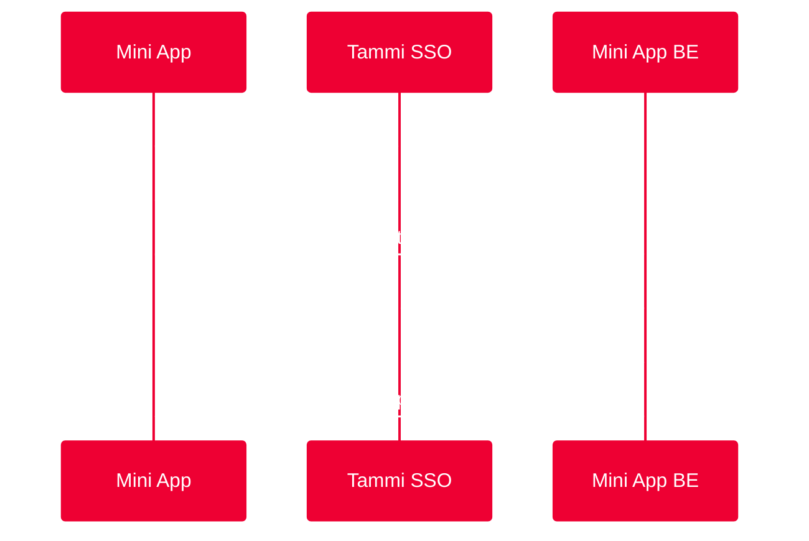

# Auth & User APIs

Các API liên quan đến xác thực người dùng và quản lý thông tin cá nhân.

## Danh sách APIs

| API | Mô tả | Quyền yêu cầu |
|-----|-------|---------------|
| [getAuthCode](./getAuthCode) | Lấy authorization code cho SSO | Có - Yêu cầu phê duyệt |
| [Contacts](./contacts) | Quản lý danh bạ (thêm, tìm, chọn) | Có - Quyền contacts |

## Luồng SSO cơ bản

Tammi SSO cho phép miniapp xác thực user mà không cần yêu cầu đăng nhập lại:



## Use Cases phổ biến

### 1. Đăng nhập tự động (Silent Login)

```javascript
const silentLogin = async () => {
  try {
    // Bước 1: Lấy authCode
    const authCode = await getAuthCode();
    
    // Bước 2: Gửi authCode lên backend
    const response = await fetch('/api/auth/login', {
      method: 'POST',
      body: JSON.stringify({ authCode })
    });
    
    const { token } = await response.json();
    
    // Bước 3: Lưu token và redirect
    localStorage.setItem('token', token);
    window.location.href = '/dashboard';
  } catch (error) {
    console.error('Silent login failed:', error);
    showLoginForm(); // Fallback sang login thủ công
  }
};
```

### 2. Kiểm tra trạng thái đăng nhập

```javascript
const checkAuthStatus = async () => {
  const token = localStorage.getItem('token');
  
  if (!token) {
    // Chưa đăng nhập - thực hiện SSO
    await silentLogin();
  } else {
    // Đã có token - verify với backend
    const isValid = await verifyToken(token);
    if (!isValid) {
      await silentLogin(); // Token hết hạn - login lại
    }
  }
};
```

### 3. Lấy thông tin user

Sau khi đăng nhập, backend có thể lấy thông tin user từ Tammi SSO:

```javascript
// Frontend gọi authCode
const authCode = await getAuthCode();

// Backend đổi authCode lấy access token
POST https://api.tammi.vn/api/v1/auth/oauth/get-access-token
Authorization: Basic <CLIENT_ID:CLIENT_SECRET>
Body: { authCode }

// Response
{
  access_token: "eyJhbGci...",
  expires_in: 432000
}

// Backend dùng access token lấy user info
GET https://api.tammi.vn/api/v1/user/user-info-by-scope
Authorization: Bearer <ACCESS_TOKEN>

// Response
{
  username: "user123",
  phoneNumber: "84987654321"
}
```

## Best Practices

### 1. Cache authCode hợp lý

```javascript
let cachedAuthCode = null;
let codeExpiry = null;

const getAuthCodeCached = () => {
  return new Promise((resolve, reject) => {
    // Kiểm tra cache
    if (cachedAuthCode && codeExpiry > Date.now()) {
      resolve(cachedAuthCode);
      return;
    }

    // Lấy code mới
    window.WindVane.call('wv', 'getAuthCode', 
      { appId: APP_ID, scopes: ['auth_user'] },
      (result) => {
        cachedAuthCode = result.authCode;
        codeExpiry = Date.now() + 5 * 60 * 1000; // Cache 5 phút
        resolve(result.authCode);
      },
      reject
    );
  });
};
```

### 2. Xử lý lỗi SSO

```javascript
const handleSSOError = (error) => {
  if (error.error === 'USER_DENIED') {
    // User từ chối cấp quyền
    showDialog({
      title: 'Yêu cầu quyền truy cập',
      message: 'Miniapp cần quyền truy cập thông tin để tiếp tục',
      onConfirm: () => retrySSO()
    });
  } else if (error.error === 'NO_PERMISSION') {
    // Miniapp chưa được cấp quyền
    alert('Miniapp chưa được kích hoạt tính năng đăng nhập SSO');
  } else {
    // Lỗi khác
    console.error('SSO error:', error);
    showLoginForm(); // Fallback
  }
};
```

### 3. Đồng bộ trạng thái login

```javascript
const syncLoginState = async () => {
  try {
    const authCode = await getAuthCode();
    const { token, user } = await loginWithAuthCode(authCode);
    
    // Lưu vào localStorage
    localStorage.setItem('token', token);
    localStorage.setItem('user', JSON.stringify(user));
    
    // Broadcast event cho các tab khác
    window.dispatchEvent(new CustomEvent('login', { detail: user }));
    
  } catch (error) {
    handleSSOError(error);
  }
};
```

## Lưu ý quan trọng

:::danger authCode chỉ dùng một lần
authCode là **one-time use** - sau khi đổi lấy access token, authCode không thể sử dụng lại. Backend cần lưu access token hoặc tạo session riêng cho miniapp.
:::

:::warning Không lưu authCode
**KHÔNG BAO GIỜ** lưu authCode vào localStorage hoặc cookie. authCode chỉ nên tồn tại trong memory và gửi ngay lên backend.
:::

:::info Môi trường phát triển
`getAuthCode` chỉ hoạt động khi miniapp chạy trong Tammi Superapp. Không hoạt động ở local preview. Để test, cần deploy lên môi trường dev/staging.
:::

## Xem thêm

- [Cơ chế SSO chi tiết](../../sso_auth/cach_thuc_hoat_dong)
- [Triển khai SSO Frontend](../../sso_auth/frontend)
- [Triển khai SSO Backend](../../sso_auth/backend)
