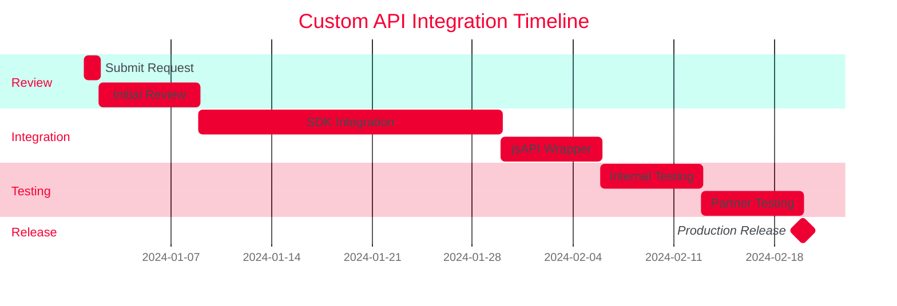

# Yêu cầu API tùy chỉnh

Trong một số trường hợp hiếm gặp, miniapp cần tích hợp SDK bên thứ ba hoặc tính năng native chưa có trong danh sách jsAPI.

## Khi nào cần Custom API?

| Trường hợp | Ví dụ |
|------------|-------|
| **SDK bên thứ ba** | SDK thanh toán đặc thù, analytics platform |
| **Native feature đặc biệt** | Xác thực sinh trắc học, VoIP |
| **Hardware chưa hỗ trợ** | NFC, fingerprint scanner đặc thù |

:::caution Quy trình phức tạp
Tích hợp Custom API yêu cầu:
- Xét duyệt bảo mật SDK
- Tích hợp vào Tammi Superapp (2-4 tuần)
- Chỉ áp dụng khi **không thể** xử lý qua backend API
:::

## Quy trình yêu cầu

### Bước 1: Đánh giá khả thi

Trước khi yêu cầu Custom API, hãy xem xét các phương án thay thế:

| Phương án | Khi nào áp dụng |
|-----------|-----------------|
| **Backend API** | SDK có thể gọi từ server (thanh toán, xác thực...) |
| **jsAPI hiện có** | Chức năng tương tự đã có sẵn |
| **Webview** | Tích hợp qua iframe/webview |

Chỉ yêu cầu Custom API khi **không có phương án nào khả thi**.

### Bước 2: Chuẩn bị tài liệu

Cần cung cấp:

1. **Business Case**: Tại sao cần API này?
2. **SDK Documentation**: Tài liệu SDK bên thứ ba
3. **Security Assessment**: Đánh giá bảo mật
4. **Impact Analysis**: Ảnh hưởng đến hiệu năng, pin, dữ liệu

### Bước 3: Gửi yêu cầu

Gửi yêu cầu qua Dashboard hoặc liên hệ trực tiếp:

```
To: api-request@tammi.vn
Subject: [Custom API Request] <Tên SDK/Feature>

1. Business Case
   - Miniapp: <Tên miniapp>
   - Use case: <Mô tả chi tiết>
   - Expected users: <Số lượng user dự kiến>

2. Technical Details
   - SDK: <Tên SDK + version>
   - Platform: iOS / Android / Both
   - Documentation: <Link>

3. Security & Privacy
   - Data collected: <Loại dữ liệu>
   - Permissions required: <Quyền cần thiết>
   - Privacy policy: <Link>

4. Alternatives Considered
   - Why backend API won't work: <Lý do>
   - Why existing jsAPI won't work: <Lý do>
```

### Bước 4: Review & Approval

Viettel sẽ review trong vòng **5-7 ngày làm việc**:

- ✓ **Approved**: Tiếp tục bước tích hợp
- ✗ **Rejected**: Phản hồi lý do và phương án thay thế
- ⏳ **Needs More Info**: Yêu cầu thông tin bổ sung

### Bước 5: Tích hợp

Nếu được duyệt, Viettel sẽ:

1. Tích hợp SDK vào Superapp (2-4 tuần)
2. Tạo jsAPI wrapper cho SDK
3. Cung cấp tài liệu API
4. Test và release

## Ví dụ

### Case Study 1: SDK Payment Gateway

**Yêu cầu:** Tích hợp cổng thanh toán X vào miniapp

**Quyết định:**
- ✗ Custom API không cần thiết
- ✓ Giải pháp: Xử lý thanh toán qua backend, trả kết quả về miniapp

**Lý do:** SDK thanh toán chỉ cần gọi từ backend, không cần native integration.

### Case Study 2: Biometric Authentication

**Yêu cầu:** Xác thực vân tay/khuôn mặt

**Quyết định:**
- ✓ Custom API được approve
- Tích hợp: SDK xác thực sinh trắc học vào Superapp

**Lý do:** Xác thực sinh trắc học yêu cầu native API, không thể xử lý qua backend.

## Phí và chi phí

| Loại | Chi phí |
|------|---------|
| **Review Request** | Miễn phí |
| **Integration** | Tùy độ phức tạp, thương lượng với Viettel |
| **Maintenance** | Bao gồm trong phí duy trì miniapp |

:::info Không đảm bảo approval
Viettel có quyền từ chối yêu cầu nếu SDK/feature không phù hợp với nền tảng hoặc gây rủi ro bảo mật.
:::

## Timeline dự kiến



Tổng thời gian: **~6-8 tuần** từ submit đến production.

## Liên hệ

Nếu miniapp cần Custom API, liên hệ đầu mối:

| Mảng | Đầu mối | Email |
|------|---------|-------|
| Backend, SSO | Hà Anh Vũ | vuha13@viettel.com.vn |
| Android | Kiều Văn Bảo | baokv2@viettel.com.vn |

## FAQ

<details>
<summary>Có thể tự tích hợp SDK vào miniapp không?</summary>

Không. Miniapp chạy trong sandbox, không thể tự tích hợp SDK native. Tất cả SDK phải được tích hợp vào Superapp bởi Viettel.

</details>

<details>
<summary>Tại sao không cho phép tự tích hợp?</summary>

- **Bảo mật**: SDK có thể chứa mã độc, truy cập dữ liệu nhạy cảm
- **Hiệu năng**: SDK kém chất lượng ảnh hưởng đến toàn Superapp
- **Kiểm soát**: Viettel cần kiểm soát những gì chạy trong Superapp

</details>

<details>
<summary>Có thể request nhiều Custom API cùng lúc không?</summary>

Có, nhưng mỗi request sẽ được đánh giá riêng. Ưu tiên các request có business case rõ ràng và ảnh hưởng lớn.

</details>

## Xem thêm

- [jsAPI hiện có](./A_app_base/index) - Kiểm tra xem đã có API phù hợp chưa
- [Backend Integration](../sso_auth/backend) - Xử lý logic qua backend
