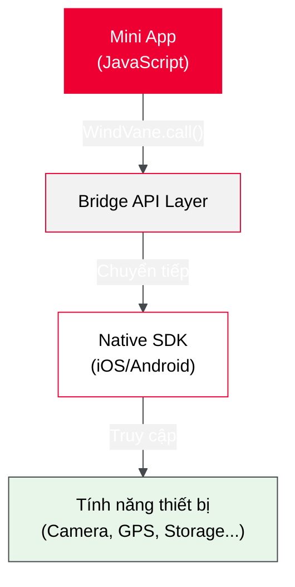

import HoTro from '../_shared/_ho_tro.mdx';

# Bridge API (jsAPI)

## Bridge API cho phép bạn làm gì?

Bridge API (jsAPI) là cầu nối giữa miniapp và các tính năng native của thiết bị. Nhờ đó, miniapp có thể:

| Khả năng                | Ví dụ use case                                   |
| ----------------------- | ------------------------------------------------ |
| **Xác thực người dùng** | Đăng nhập tự động qua tài khoản Tammi (SSO)      |
| **Truy cập phần cứng**  | Camera (scan QR), GPS (bản đồ), Bluetooth (IoT)  |
| **Tùy chỉnh giao diện** | Thay đổi navigation bar, hiển thị loading, toast |
| **Điều hướng**          | Mở Mini App khác trong hệ sinh thái Tammi        |
| **Lưu trữ**             | Lưu dữ liệu local trên thiết bị                  |

:::tip Web app thuần có thể chạy mà không cần Bridge API
Bridge API là **tùy chọn**. Nếu miniapp chỉ cần logic nghiệp vụ cơ bản và không cần truy cập phần cứng, bạn hoàn toàn có thể bỏ qua phần này.
:::

## Kiến trúc Bridge API



**Luồng xử lý:**

1. Miniapp gọi `WindVane.call(module, method, params)`
2. Bridge chuyển request sang native layer
3. Native thực thi (yêu cầu quyền nếu cần)
4. Kết quả trả về qua callback `success` hoặc `fail`

## Giới hạn kỹ thuật của Bridge API

Bridge API mạnh mẽ nhưng **không phải là native app**. Một số giới hạn cần lưu ý:

| Giới hạn                    | Giải thích                         | Giải pháp                                    |
| --------------------------- | ---------------------------------- | -------------------------------------------- |
| **Không chạy background**   | Miniapp dừng khi người dùng thoát  | Sử dụng backend để xử lý tác vụ dài hạn      |
| **Không push notification** | Không thể gửi thông báo chủ động   | Dùng superapp notification API (qua backend) |
| **Giới hạn memory**         | ~100MB RAM                         | Tối ưu code, tránh memory leak               |
| **Giới hạn bundle size**    | 2MB (khuyến nghị)                  | Code splitting, lazy loading                 |
| **Quyền hạn hạn chế**       | Chỉ truy cập qua API đã được duyệt | Không thể yêu cầu quyền tùy ý như native app |

:::info Tại sao có giới hạn này?
Miniapp chạy trong **sandbox** để đảm bảo bảo mật và ổn định. Mọi tương tác với thiết bị đều phải đi qua lớp kiểm soát của superapp. Đây là trade-off giữa **bảo mật** và **tính năng**.
:::

## Trường hợp đặc biệt: SDK Integration

:::caution Yêu cầu tư vấn từ Viettel
Trong một số trường hợp **hiếm gặp**, miniapp cần tích hợp SDK của bên thứ ba (ví dụ: SDK thanh toán đặc thù, analytics platform) **trực tiếp vào native layer** của Tammi Superapp.

**Luồng:** Miniapp → Bridge API → **SDK đã tích hợp sẵn trong Superapp** → Thiết bị

**Điều kiện:**

- SDK phải được Viettel xét duyệt về bảo mật và hiệu năng
- Chỉ áp dụng khi **không thể** xử lý qua backend API thông thường
- Thời gian tích hợp phụ thuộc chu kỳ release của Superapp (thường 2-4 tuần)

**Khi nào cần:** Khi SDK yêu cầu quyền truy cập native (ví dụ: SDK xác thực sinh trắc học, SDK VoIP) mà Bridge API hiện tại không hỗ trợ.

Nếu miniapp của bạn thuộc trường hợp này, liên hệ Viettel để được tư vấn và đánh giá khả thi.
:::

## Sample Code đầy đủ

Repository mẫu demo **toàn bộ Bridge API** có sẵn:

👉 **https://github.com/mahou-anisphia/miniapp-sample-code**

Repo này chứa ví dụ thực tế cho từng API: xác thực, camera, GPS, navigation, storage, UI components, có thể khởi chạy như sau:

1. Clone repo về máy:

```bash title="Terminal"
git clone https://github.com/mahou-anisphia/miniapp-sample-code.git
```

2. Di chuyển vào thư mục project:

```bash title="Terminal"
cd miniapp-sample-code
```

3. Cài đặt dependencies:

```bash title="Terminal"
npm install
```

4. Chạy sample code:

```bash title="Terminal"
npm start
```

:::warning API đặc biệt
`getAuthCode` (xác thực SSO) là API riêng của Tammi, **không hoạt động** ở chế độ local preview. API này chỉ hoạt động sau khi deploy lên nền tảng.
:::

## Tiếp theo

**Chưa chắc cần Bridge API?** Xem [Lựa chọn phương thức tích hợp](./lua_chon_tich_hop) để so sánh các phương án phù hợp với nhu cầu của bạn.

**Đã quyết định dùng Bridge API?** Tiếp tục với:

- **Chi tiết từng API**: [Tài liệu jsAPI](../jsapi/) - tham số, quyền yêu cầu, use case
- **Bắt đầu phát triển**: [Quick Start](../quick_start/index) - chạy miniapp đầu tiên với boilerplate
- **Tích hợp SSO**: [Cơ chế SSO](../sso/) - luồng xác thực người dùng

<HoTro />
