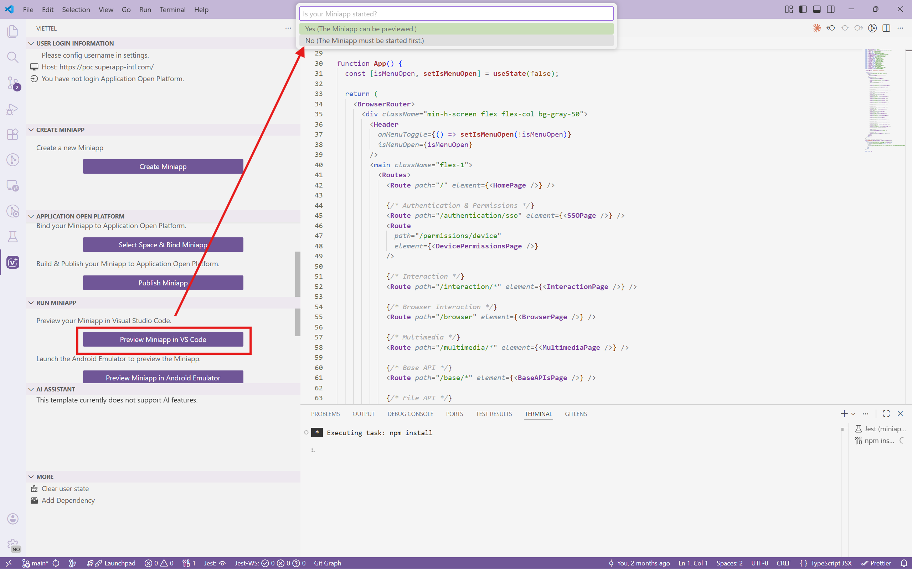
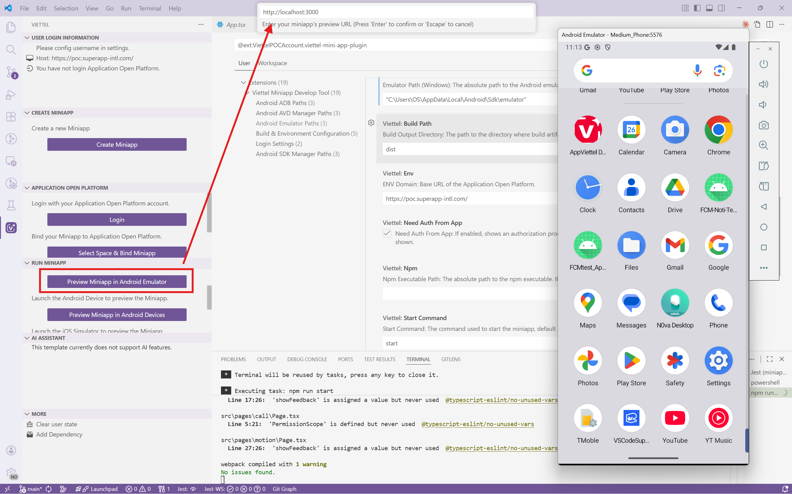
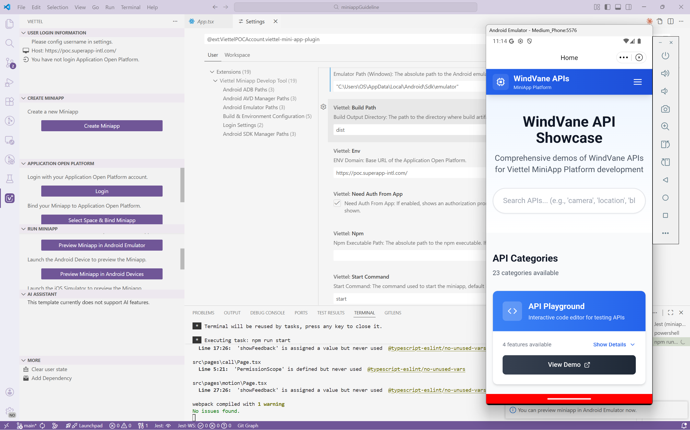
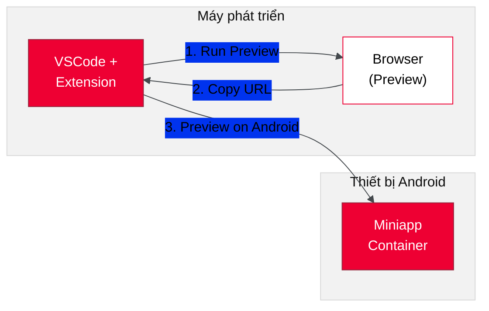

# Phát triển Miniapp

## Bước 1: Clone boilerplate

Clone repo boilerplate về máy:

```bash title="Terminal"
git clone https://github.com/artificial-farmers/react-miniapp-boilerplate.git
```

Di chuyển vào thư mục project:

```bash title="Terminal"
cd react-miniapp-boilerplate
```

Cài đặt dependencies:

```bash title="Terminal"
npm install
```

:::note Boilerplate khác
Hiện tại chỉ có boilerplate cho **React**. Vue và Angular sẽ được bổ sung sau.
:::

## Bước 2: Preview trên VSCode

1. Mở project trong VSCode
2. Mở **Miniapp Extension** từ sidebar
3. Chọn **Run Preview in VSCode**



4. Khi được hỏi "is your miniapp started", chọn **NO**. Browser sẽ mở với miniapp đang chạy
5. **Copy URL** trên thanh địa chỉ browser (sẽ dùng ở bước sau)

## Bước 3: Preview trên Android

Để test Bridge API (jsAPI), bạn cần chạy miniapp trên thiết bị Android:

1. Trong **Miniapp Extension**, chọn **Preview on Android Device/Emulator**

2. Khi được hỏi _"Enter miniapp URL"_, **paste URL** đã copy từ browser



3. Miniapp sẽ được load trên thiết bị Android





:::warning Bridge API chỉ hoạt động trên thiết bị mobile (iOS / Android)
Trên browser, bạn **không thể** gọi Bridge API (jsAPI) vì không có native layer. Các tính năng như camera, GPS, storage... chỉ hoạt động khi preview trên thiết bị mobile (iOS / Android) thật hoặc emulator.
:::

## Tiếp theo

Miniapp đầu tiên đã chạy. Xem [Bước tiếp theo](./buoc_tiep_theo) để tìm hiểu thêm về Bridge API và sample code.
